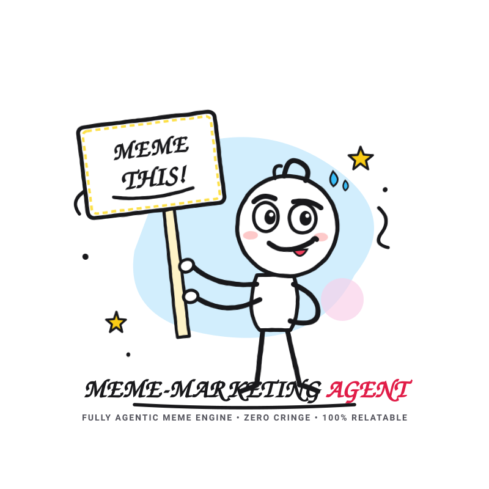
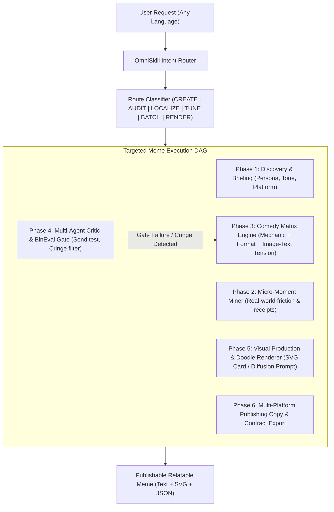

<div align="center">



# 🎭 Meme Marketing: Fully Agentic Meme Crafting Engine

### High-resonance, zero-cringe memes grounded in hyper-specific audience friction, real receipts, and cultural authenticity.
**Universal AI Agent Skill • Built-in Vector Doodle Renderer • Multi-Dialect Comedy Matrix • BinEval 8-Gate Quality Filter**

<br />

[](LICENSE)
[](https://bun.sh)
[](https://www.typescriptlang.org/)
[](https://claude.ai)
[](#-claude-code-plugin-marketplace-agents--hooks)
[](agents)
[](hooks/hooks.json)
[](https://deepmind.google)
[](https://cursor.com)
[](https://chatgpt.com)
[](https://skills.sh/meme-marketing)
[](references/bineval-gates.md)
[](references/bineval-gates.md)

<p align="center">
  <a href="#-features">Features</a> •
  <a href="#-installation-guide">Install Guide</a> •
  <a href="#-claude-code-plugin-marketplace-agents--hooks">Claude Plugin</a> •
  <a href="#-quickstart">Quickstart</a> •
  <a href="#-architecture">Architecture</a> •
  <a href="#-cli-reference">CLI Reference</a> •
  <a href="#-doodle-templates">Templates</a> •
  <a href="#-examples">Examples</a>
</p>

</div>

---

## 💡 What is Meme Marketing Agent?

Most AI-generated memes are agonizingly corporate: generic templates, forced puns, and transparent product pitches that make audiences cringe.

**Meme Marketing Agent** transforms your AI agent into an elite satirical comedy writer. Operating under the **/omni-skill** dynamic routing architecture, it mines real-world daily friction (like pushing an unreviewed PR at 4:58 PM on a Friday or getting client revisions after midnight), pairs them with proven comedic mechanisms, subjects them to 8 adversarial quality gates, and can even render them into **funny doodle line-art SVG cards** on demand.

### 🌟 Key Capabilities
- 💡 **Canonical Humor Inspiration**: Infused with real-world creative agency, startup, and domestic satire from the **[Meme Marketing Master Deck (Google Slides)](https://docs.google.com/presentation/d/1Dnxy0wxP8G4k_9LToeDuopg-hcqxcg3jg7gIb4u_K2A/edit?usp=drive_link)** (pricing disparity irony, 16-hr work vs. LinkedIn virtue signaling, AI vs. Pen Tool).
- 🎯 **Tactile Receipts**: Grounded in specific error messages, timestamps (`11:47 PM`), tool names (`Docker`, `Figma`, `Excel`), and real team dynamics.
- 🌍 **Multi-Dialect Mastery**: Native fluency in **English** (Tech/B2B/Dev cynicism), **Egyptian Arabic** (Cinema echoes, witty colloquial irony), **Saudi/Gulf Arabic** (Riyadh tech scene, X feed banter), and **Levantine Arabic**.
- 🚫 **Zero Cringe Guarantee**: Automated filters eliminate corporate slogans, on-image sales pitches, hashtags, and URLs.
- 🎨 **Built-in Doodle Renderer**: Generate standalone, scalable SVG doodle meme cards directly from terminal or prompt.
- 🔄 **Continuous Taste Profiling**: `meme-craft tune` records what your brand and audience accept or reject in `.claude/meme-marketing/taste-profile.json`, and a SessionStart hook loads it into every new Claude Code session.
- 🧩 **Claude Code Plugin**: Install from the Claude marketplace and get the skill, 4 specialist subagents, 5 slash commands and 2 guardrail hooks in one step.

---

## 📦 Installation Guide

Install `meme-marketing` across any AI coding agent or command line environment in seconds.

### 0. Claude Code Marketplace (Recommended for Claude Code)
Inside any Claude Code session:

```text
/plugin marketplace add imMamdouhaboammar/meme-marketing
/plugin install meme-marketing@meme-marketing
```

Then run `/reload-plugins` (or restart Claude Code). This installs the full plugin: skill, subagents, slash commands and hooks. Update later with `/plugin marketplace update meme-marketing`.

From the terminal instead:

```bash
claude plugin marketplace add imMamdouhaboammar/meme-marketing
claude plugin install meme-marketing@meme-marketing
```

For teams, pin it in the project's `.claude/settings.json` so every teammate gets the same plugin when they trust the folder:

```json
{
  "extraKnownMarketplaces": {
    "meme-marketing": {
      "source": { "source": "github", "repo": "imMamdouhaboammar/meme-marketing" }
    }
  },
  "enabledPlugins": {
    "meme-marketing@meme-marketing": true
  }
}
```

Try a local checkout without installing: `claude --plugin-dir ./meme-marketing`.

### 1. One-Line Universal Auto-Installer
Automatically detects all installed agent environments (`Claude Code`, `Google Antigravity`, `Gemini CLI`, `Cursor`, `Codex`, and `Agent Kernel`) and installs the skill:

```bash
curl -fsSL https://raw.githubusercontent.com/imMamdouhaboammar/meme-marketing/main/install.sh | bash
```

*Or run directly if you have cloned the repository:*
```bash
./install.sh
```

---

### 2. Manual Installation by Agent Harness

#### 🟠 Claude Code & Claude Desktop (manual copy)
Prefer the marketplace install above for Claude Code. A manual copy into `~/.claude/skills` loads as a local plugin (`meme-marketing@skills-dir`, with subagents, commands and hooks) on recent Claude Code versions; older versions and Claude Desktop pick up the skill only. Run `claude plugin list` to see which one you got.
```bash
# Option A: Via Skills.sh
npx skills add imMamdouhaboammar/meme-marketing

# Option B: Manual clone into Claude skills directory
mkdir -p ~/.claude/skills
git clone https://github.com/imMamdouhaboammar/meme-marketing.git ~/.claude/skills/meme-marketing
```

#### 🔵 Google Antigravity & Gemini CLI
Clone into your Gemini / Antigravity config directory:
```bash
mkdir -p ~/.gemini/config/skills
git clone https://github.com/imMamdouhaboammar/meme-marketing.git ~/.gemini/config/skills/meme-marketing
```

#### 🟣 Cursor IDE & Windsurf
Add to your project root or user configuration:
```bash
mkdir -p .cursor/skills
git clone https://github.com/imMamdouhaboammar/meme-marketing.git .cursor/skills/meme-marketing
```
*Or add this rule to `.cursorrules` / `.windsurfrules`:*
```text
When asked to create memes or social humor, refer to instructions in .cursor/skills/meme-marketing/SKILL.md
```

#### 🟢 OpenAI Codex & ChatGPT
Copy or link the package to your Codex skills directory:
```bash
mkdir -p ~/.codex/skills
git clone https://github.com/imMamdouhaboammar/meme-marketing.git ~/.codex/skills/meme-marketing
```
*The root `.codex-plugin/plugin.json` is pre-configured and ready for ChatGPT Actions and custom GPTs.*

#### ⚡ Zero-Install CLI (Any Terminal)
Run immediately without installation using Bun or npx:
```bash
# Using Bun (instant TS execution)
bunx meme-marketing --help

# Using npx
npx meme-marketing list
```

---

## ⚡ Quickstart

Once installed, simply prompt your agent naturally:

### Example Prompts

#### 1. English Developer Culture
> *"Craft 3 memes for our open-source developer tooling project. Our audience is senior backend engineers who hate slow CI/CD pipelines. Platform: X (Twitter)."*

#### 2. Egyptian B2B SaaS
> *"عايز 3 ميمز لصفحة PrePilot، منصة بتساعد الماركتير يحسب الميزانية وميديا بلان قبل الحملة. الجمهور بتاعنا performance marketers في مصر. باللهجة المصرية ولينكد إن."*

#### 3. Saudi E-Commerce Logistics
> *"اكتبلي ميمز لشركة شحن وتوصيل B2B في الرياض، لمدراء العمليات وأصحاب المتاجر الإلكترونية. نبيها باللهجة السعودية لـ X مع ريندر دودل."*

---

## 🧩 Claude Code Plugin: Marketplace, Agents & Hooks

The repository is a Claude Code plugin and its own single-plugin marketplace. Both manifests live in `.claude-plugin/` and pass `claude plugin validate --strict` in CI.

```text
Skills (1)     meme-marketing
Commands (5)   /meme  /meme-audit  /meme-localize  /meme-render  /meme-calendar
Agents (4)     meme-moment-miner  meme-bineval-critic  meme-dialect-localizer  meme-doodle-renderer
Hooks (2)      PostToolUse (Write|Edit|MultiEdit)  SessionStart
```

### 🤖 Specialist Subagents

Each subagent runs in its own context window with only the tools it needs, so the main conversation stays focused on the brief.

| Agent | Phase | Tools | What it returns |
|---|---|---|---|
| `meme-moment-miner` | Phase 2 · CREATE, BATCH | Read, Grep, Glob, WebSearch, WebFetch | 12 to 20 audience moments with receipts, top 5 ranked with a Send Test target and provenance |
| `meme-bineval-critic` | Phase 4 · AUDIT | Read, Grep, Glob, Bash | Validator output, an 8-gate pass/fail table and one concrete repair per failure |
| `meme-dialect-localizer` | LOCALIZE | Read, Grep, Glob | The joke rebuilt for Egyptian, Saudi/Gulf, Levantine or English with native receipts |
| `meme-doodle-renderer` | Phase 5 · RENDER | Read, Glob, Bash | An SVG doodle card saved in your folder, or a designer brief when no template fits |

Claude delegates to them automatically during the skill's DAG. You can also call one directly: *"Use the meme-bineval-critic agent on memes.json"*.

### ⌨️ Slash Commands

| Command | Route | Example |
|---|---|---|
| `/meme` | CREATE | `/meme Friday deploys, senior backend engineers, english, X` |
| `/meme-audit` | AUDIT | `/meme-audit ./out/launch-batch.json` |
| `/meme-localize` | LOCALIZE | `/meme-localize the "this is fine" budget meme to saudi` |
| `/meme-render` | RENDER | `/meme-render two-buttons "Deploy Friday 5PM" vs "Calm weekend", actor DevOps Lead` |
| `/meme-calendar` | BATCH | `/meme-calendar PrePilot, Egyptian performance marketers, 2 weeks, egyptian, LinkedIn + Facebook` |

If another plugin uses the same name, call it with the namespace, for example `/meme-marketing:meme`.

### 🪝 Hooks

| Event | Trigger | What happens |
|---|---|---|
| `PostToolUse` | Claude writes or edits a `.json` file whose root has `"skill": "meme-marketing"` | Runs `scripts/validate.py`. A failing batch is blocked and Claude gets the exact failures to repair. A passing batch gets a one-line confirmation. Every other file is ignored. |
| `SessionStart` | New, resumed, cleared or compacted session | Reads `.claude/meme-marketing/taste-profile.json` in the project and loads confirmed, tentative and rejected preferences as short context. Prints nothing when the profile is missing or empty. |

Both hooks use only the Python 3 standard library, time out after a few seconds, and fail open: a crash never blocks your session. Record feedback for the SessionStart hook with:

```bash
bunx meme-marketing tune --accept meme-2 --note "deadpan lands with this audience"
bunx meme-marketing tune --reject meme-4 --note "drake template feels stale for B2B"
bunx meme-marketing tune --note "avoid salary jokes"   # saved as tentative until confirmed
```

---

## 🏛️ Architecture & Execution Flow

Operating under the canonical `/omni-skill` dynamic routing pattern:



---

## 🛠️ CLI Reference (`meme-craft`)

The built-in CLI provides instant utilities for generating, rendering, and validating memes:

```bash
meme-craft <command> [options]
```

### Commands & Flags

| Command | Options | Description |
|---|---|---|
| `craft` | `--topic`, `--audience`, `--dialect`, `--platform`, `--json` | Synthesize complete meme specs or machine-readable JSON |
| `render` | `--template`, `--caption`, `--new`, `--user`, `--current`, `--out` | Render vector doodle line-art meme card (`.svg`) |
| `validate` | `<path-to-json>` | Validate batch JSON against output contract and cringe filters |
| `list` | *none* | Display catalog of humor mechanics, formats, and doodle templates |
| `tune` | `--accept <id>`, `--reject <id>`, `--note <text>`, `--profile <path>` | Record feedback in `.claude/meme-marketing/taste-profile.json` (a bare `--note` is saved as tentative) |

---

## 🎨 Built-in Doodle Line-Art Templates

The engine includes 4 pre-drawn, funny doodle vector templates ready for instant rendering:

| Template Name | Identifier | Best For |
|---|---|---|
| **Distracted Marketer** | `distracted` | Choosing a shiny new trend/framework over existing critical duties |
| **Two Buttons Dilemma** | `two-buttons` | Agonizing between two equally stressful or tempting options |
| **This is Fine** | `this-is-fine` | Unfazed calm while servers, budgets, or deadlines burn down |
| **Doodle Approve / Reject** | `drake` | Disapproving legacy slow workflows vs approving modern agentic workflows |

### CLI Rendering Example:
```bash
bun scripts/meme-craft.ts render --template distracted \
  --caption "Every single Friday at 4:30 PM" \
  --new "Rewriting the backend in Rust" \
  --user "Senior Architect" \
  --current "24 unresolved client tickets" \
  --out friday-dilemma.svg
```

---

## 🛡️ The 8 BinEval Quality Gates

Every meme generated must pass 8 strict gates:

1. **The Send Test**: You can name the exact human who forwards this to whom in Slack/DMs.
2. **The Receipt Check**: Grounded in specific, tactile real-world details (`11:47 PM`, `Docker build`, `Excel formula error`).
3. **Image-Text Contract**: Caption and visual have tension or dialogue; neither is redundant.
4. **Feed Glance Test**: The joke registers in under 1.5 seconds at feed speed.
5. **Logo-Free Share Test**: Funny even if the company logo is covered.
6. **Batch Variety**: Every concept uses a distinct comedic mechanism and visual format.
7. **Zero Cringe Guarantee**: Automated check bans on-image URLs, CTAs, hashtags, and corporate jargon.
8. **Dialect Integrity**: True spoken phrasing; never stiff Modern Standard Arabic or unconvincing slang.

---

## 📁 Repository Structure

```text
├── .claude-plugin/
│   ├── plugin.json           # Claude Code plugin manifest
│   └── marketplace.json      # Claude Code marketplace catalog
├── agents/                   # Claude Code subagents
│   ├── meme-moment-miner.md
│   ├── meme-bineval-critic.md
│   ├── meme-dialect-localizer.md
│   └── meme-doodle-renderer.md
├── commands/                 # Slash commands (/meme, /meme-audit, ...)
├── hooks/
│   ├── hooks.json            # PostToolUse + SessionStart hook config
│   └── handlers/             # Python hook handlers (stdlib only)
├── assets/
│   ├── logo.svg              # Funny Doodle Line-Art Vector Logo
│   ├── logo.png              # High-res visual asset
│   ├── taste-profile.json    # Empty taste profile template
│   └── templates/            # Hand-drawn vector meme templates (SVG)
│       ├── distracted-doodle.svg
│       ├── two-buttons-doodle.svg
│       ├── this-is-fine-doodle.svg
│       └── drake-doodle.svg
├── bin/
│   └── cli.js                # Executable CLI entrypoint (Bun & Node)
├── evals/
│   ├── evals.json            # Benchmark test cases
│   └── fixtures/             # Valid and invalid JSON test cases
├── references/
│   ├── deck-patterns.md      # Canonical Google Slides deck inspiration & patterns
│   ├── agentic-router.md     # Dynamic routing & DAG execution spec
│   ├── bineval-gates.md      # The 8 quality gates & anti-cringe filters
│   ├── caption-craft.md      # Dialect rules, pacing & mobile cadence
│   ├── design-spec.md        # Typography, contrast & safe areas
│   ├── format-bank.md        # Taxonomy of visual formats
│   ├── host-compatibility.md # Per-agent capability profiles
│   ├── humor-mechanics.md    # 10 comedic mechanics & voices
│   ├── output-contract.md    # JSON schema specification
│   └── post-tuning.md        # Continuous taste learning guide
├── scripts/
│   ├── meme-craft.ts         # Agentic CLI engine & SVG renderer
│   ├── validate.py           # Python 3 validator
│   ├── test_validate.py      # Contract validator unit tests
│   └── test_plugin.py        # Plugin manifests, agents, commands & hooks tests
├── .codex-plugin/
│   └── plugin.json           # OpenAI Codex manifest
├── .github/workflows/
│   └── ci.yml                # GitHub Actions test pipeline
├── .skills.json              # Skills.sh registry manifest
├── install.sh                # Universal multi-agent installer
├── package.json              # Bun / npm distribution manifest
├── SKILL.md                  # Canonical Agentic Skill contract
└── README.md                 # High-presence documentation
```

---

## 🤝 Contributing

Contributions of new funny doodle templates, humor mechanics, and dialect nuances are welcome! Please run tests before submitting PRs:

```bash
bun run lint
bun run test                # contract validator + plugin/hook tests
bun run validate:plugin     # claude plugin validate --strict on both manifests
```

---

## 📄 License

MIT © [Mamdouh Aboammar](https://github.com/imMamdouhaboammar)
