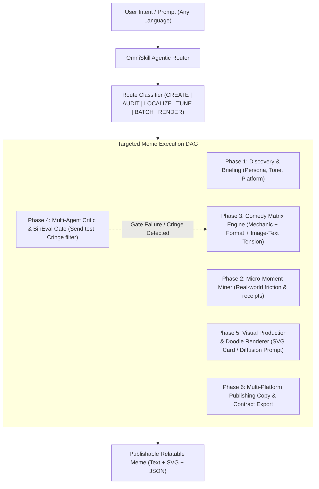

<!-- version: "3.1.1" -->

# 🎭 Meme Marketing: Fully Agentic Meme Crafting Engine

Build and distribute high-resonance, zero-cringe memes grounded in real audience friction, specific receipts, and cultural authenticity across English, Egyptian Arabic, Saudi Arabic, and Levantine dialects.

The dynamic execution invariant is:

$$\text{Intent (Any Lang)} \xrightarrow{\text{OmniSkill Router}} \text{Execution DAG} \xrightarrow{\text{Comedy Engine}} \text{BinEval Gate} \xrightarrow{\text{Doodle Renderer}} \text{Publishable Asset}$$

---

## ⚡ Dynamic Agentic Routing

For any prompt in natural language, the agent dynamically classifies intent and constructs an optimal multi-step Directed Acyclic Graph (DAG):



### Route Selection

| Mode | Trigger Phrase / Intent | Primary Deliverable |
|---|---|---|
| **CREATE** | "make a meme about X", "craft 3 funny posts for our B2B SaaS" | 3-5 distinct concepts + publishable captions + visual briefs + SVG render |
| **AUDIT** | "review this meme", "why didn't this post land?", "is this cringe?" | Cringe analysis + Send Test evaluation + 1-pass punchline repair |
| **LOCALIZE** | "translate this meme to Egyptian/Saudi", "adapt for Gulf audience" | Cultural reconstruction using native idioms, movie receipts & feed habits |
| **TUNE** | "our audience prefers deadpan", "update taste profile with this feedback" | Updated project profile `.claude/meme-marketing/taste-profile.json` (template: `assets/taste-profile.json`) via `meme-craft tune` |
| **BATCH** | "build a 2-week meme calendar", "diverse meme mix for launch" | Content matrix balancing brand roles (none, prop, character, product) |
| **RENDER** | "render this meme into an image/SVG", "draw a doodle meme" | Instant vector SVG file via `assets/templates/` or `meme-craft render` |


### Specialist Subagents (Claude Code plugin)

When this skill runs as the `meme-marketing` Claude Code plugin, four subagents ship with it. Delegate to them and always pass this skill's root directory path in the delegation prompt so they can read `references/` and run `scripts/`.

| Subagent | Phase / Route | Hand it | It returns |
|---|---|---|---|
| `meme-moment-miner` | Phase 2, CREATE, BATCH | audience, market or dialect, platform, product context | 12 to 20 moments with receipts, top 5 ranked with Send Test targets |
| `meme-bineval-critic` | Phase 4, AUDIT | concepts or a batch JSON path | validator output, 8-gate table, one repair per failure |
| `meme-dialect-localizer` | LOCALIZE | source meme and target dialect(s) | native moment, swapped receipts, caption and on-image text |
| `meme-doodle-renderer` | Phase 5, RENDER | approved copy and template | SVG path in the user's folder, or a designer brief |

In hosts without subagents, run the same steps inline. Slash commands `/meme`, `/meme-audit`, `/meme-localize`, `/meme-render` and `/meme-calendar` map to the routes above.

### Plugin Hooks

- **PostToolUse (Write/Edit)**: any saved JSON whose root has `"skill": "meme-marketing"` is checked with `scripts/validate.py`. A failing batch is blocked with the exact failures; fix them and save again. Other files are ignored.
- **SessionStart**: if the project has `.claude/meme-marketing/taste-profile.json` with recorded decisions, a short summary is loaded as context. Apply it only when writing memes. Record decisions with `meme-craft tune --accept <id> | --reject <id> | --note "<reason>"`.
---

## 🚀 The 6-Phase Execution DAG

### Phase 1: Discovery & Briefing
Establish the foundational parameters before brainstorming:
1. **Target Subculture**: Define a specific human, not a demographic label (e.g. *Senior DevOps on-call at 2 AM*, not *"IT professionals"*).
2. **Platform & Feed Speed**: Tailor density for LinkedIn, X (Twitter), Instagram, or Slack.
3. **Dialect Nuance**:
   - **English**: Developer/tech cynicism, startup irony, corporate jargon subversion.
   - **Egyptian Arabic (عامية مصرية)**: Cinema dialogue echoes, conversational self-deprecation, rhythmic punchlines.
   - **Saudi/Gulf Arabic (عامية سعودية)**: Riyadh tech/e-commerce references, platform-native X banter.
   - **Levantine Arabic (عامية شامية)**: Agency and startup vernacular.
4. *Rule*: Ask only for truly blocking details; otherwise declare one practical assumption and proceed.

### Phase 2: Micro-Moment Mining
A meme lands when someone recognizes a hyper-specific situation:
- Mine 12 to 20 plausible micro-situations (privately in chain of thought).
- Locate each moment with **concrete receipts**: exact timestamps (`11:47 PM`), tool names (`Docker`, `Figma`, `Excel`), error codes, or specific physical actions.
- Select the top 3-5 moments with the highest forward-to-a-friend impulse.
- *Mandatory Rule*: Never invent measured client stats or present creative fiction as empirical fact.

### Phase 3: Comedy Matrix Engine
Combine three independent levers (see `references/humor-mechanics.md` and `references/format-bank.md`):
1. **Mechanic**: Incongruous reaction, Understatement, Exaggeration, Reversal, Literalization, Role collision, False confidence, Escalation, Affectionate recognition, or Visual misdirection.
2. **Format**: Reaction still, original doodle scene, staged screenshot, chat mockup, UI mock, object labeling, multi-panel, or visual-only.
3. **Image-Text Relationship**: Reaction, Dialogue, Understatement, Literalization, Labeling, Contrast, Delayed reveal, Intentional echo, or Text-free.
- *Rule*: Never let one mechanic dominate a batch. Every variant must differ in comedic mechanism, not just adjectives.

### Phase 4: Multi-Agent Critic & BinEval Gate
Run the 8 immutable quality gates before releasing (see `references/bineval-gates.md`):
1. **The Send Test**: Can you name exactly who forwards this to whom?
2. **The Receipt Check**: Does an authentic phrase, tool, or timestamp locate the scene?
3. **Image-Text Contract**: Does each part add new information? Zero lazy redundancy.
4. **Feed Glance Test**: Does the core premise register in under 1.5 seconds?
5. **Logo-Free Share Test**: Is it genuinely funny even if the company logo is covered?
6. **Zero Cringe Guarantee**: No corporate slogans, no hashtags in image, no sales CTAs (`"Click here"`, `"Buy now"`).
7. **Cultural Nuance**: No robotic Modern Standard Arabic when spoken dialect was requested. No mixed dialects.
8. **Usability & Fallback**: Every concept provides an original vector or rights-cleared visual fallback.

### Phase 5: Visual Production & Doodle Renderer
Turn concepts into visual assets:
- **Instant SVG Doodle Meme**: Execute `meme-craft render` using built-in doodle line-art templates (`distracted`, `two-buttons`, `this-is-fine`, `drake`).
- **AI Diffusion Prompts**: When the user requests external image generation (Midjourney, DALL-E, Flux, Imagen), provide structured visual prompts with exact camera angles, lighting, character expressions, and stylistic guidance.
- **ASCII & Terminal Mockups**: Provide high-fidelity preview layouts in chat.

### Phase 6: Multi-Platform Publishing & Contract Delivery
Deliver ready-to-post assets:
- **Social Caption**: Paced for mobile feeds; opening hook and line breaks.
- **On-Image Text**: Concise, high-contrast, safe-area aligned.
- **Visual Brief**: Clear execution directions for designers or renderers.
- **JSON Contract**: When machine-readability is requested, conform strictly to `references/output-contract.md`.

---

## 🛠️ Instant CLI Toolchain (`meme-craft`)

Execute tasks directly from your terminal or subagent environment:

```bash
# 1. Render an instant Funny Doodle Line-Art meme (SVG)
bun scripts/meme-craft.ts render --template distracted \
  --new "Agentic Omni-Skill" \
  --user "Me" \
  --current "Writing manual prompts" \
  --caption "Once you see the execution DAG" \
  --out assets/my-doodle-meme.svg

# 2. Render a Two-Buttons dilemma doodle meme
bun scripts/meme-craft.ts render --template two-buttons \
  --option-a "Deploy on Friday 5PM" \
  --option-b "Have a calm weekend" \
  --actor "DevOps Lead" \
  --caption "The eternal dilemma" \
  --out assets/dilemma.svg

# 3. Validate a batch JSON against schema and cringe filters
bun scripts/meme-craft.ts validate evals/fixtures/valid.json

# 4. Synthesize a structured meme spec via CLI
bun scripts/meme-craft.ts craft --topic "Kubernetes Pod Crash" --audience "SREs" --dialect english

# 5. List all mechanisms, templates, and formats
bun scripts/meme-craft.ts list

# 6. Record user feedback in the project taste profile (.claude/meme-marketing/taste-profile.json)
bun scripts/meme-craft.ts tune --accept meme-2 --note "deadpan lands with this audience"
```

---

## 💡 Canonical Humor Inspiration Engine

The skill engine integrates the **[Meme Marketing Master Presentation Deck](https://docs.google.com/presentation/d/1Dnxy0wxP8G4k_9LToeDuopg-hcqxcg3jg7gIb4u_K2A/edit?usp=drive_link)** as its foundational source of real-world humor inspiration and comedic tension.

When mining micro-moments and shaping dialogue, the engine draws upon five core archetypal dynamics demonstrated in the master deck:

1. **Commercial Disparity & The Cheap Bundle**:
   - The contrast between quality work and absurd market undercutters (*"Why didn't the client respond? He's with the company offering 20 reels, a logo, and identity for 2,700 EGP"*).
2. **Workplace Exploitation vs. LinkedIn Sanctimony**:
   - The reality of 16-hour workdays for 1,200 EGP versus the CEO's epic LinkedIn essay on loyalty and passion.
3. **AI Helplessness & Craftsman Irony**:
   - The panic when AI models go offline and engineers/designers have to do tasks manually like ancient history; or the novice AI designer discovering the Pen Tool.
4. **Cross-Role Friction**:
   - The clash of mutually incompatible vocabularies (*"A graphic designer on a date with a short-form content creator"*).
5. **Authentic Domestic Relatability**:
   - Unvarnished cultural moments (*"The younger sibling who reveals family secrets to guests to liven up the room"*).

See **`references/deck-patterns.md`** for the full structural breakdown.

---

## 📚 Knowledge Base & Progressive Disclosure

Load deep guides on demand:

| Reference | Purpose |
|---|---|
| **`references/deck-patterns.md`** | **[Canonical Master Deck (Google Slides)](https://docs.google.com/presentation/d/1Dnxy0wxP8G4k_9LToeDuopg-hcqxcg3jg7gIb4u_K2A/edit?usp=drive_link)** & structural humor patterns |
| **`references/agentic-router.md`** | Dynamic routing rules, DAG coordination, and fallback policies |
| **`references/humor-mechanics.md`** | The 10 comedic mechanisms and voice calibrations |
| **`references/format-bank.md`** | Comprehensive catalog of visual forms and layout patterns |
| **`references/caption-craft.md`** | Dialect rules (Egyptian, Saudi, Levantine, English) and mobile cadence |
| **`references/bineval-gates.md`** | The 8 BinEval quality gates and automated anti-cringe tests |
| **`references/design-spec.md`** | Aspect ratios, typography hierarchy, palettes, and logo rules |
| **`references/output-contract.md`** | Formal JSON schema and validation contract |
| **`references/post-tuning.md`** | Taste profile schema and continuous feedback learning loop |
| **`references/host-compatibility.md`** | Multi-agent execution details for Claude, Antigravity, Cursor, Codex |

---

## ⚠️ Anti-Patterns & Critical Failures

- **The Corporate Slogan Trap**: Slapping a brand value proposition onto a famous template.
- **Lazy Synonym Rewrites**: Presenting 3 captions with the same joke as a "diverse batch".
- **Dialect Pollution**: Mixing Egyptian vocabulary (`كده`, `عشان`) into Saudi copy, or using stiff formal Arabic for street humor.
- **The Explanatory Crutch**: Writing text on the image to explain why the visual is funny.
- **Unverified Recency**: Claiming an unproven internet trend is "current" without a dated receipt.
- **Promotional Graffiti**: Putting URLs, coupon codes, or hashtags inside the meme image.
