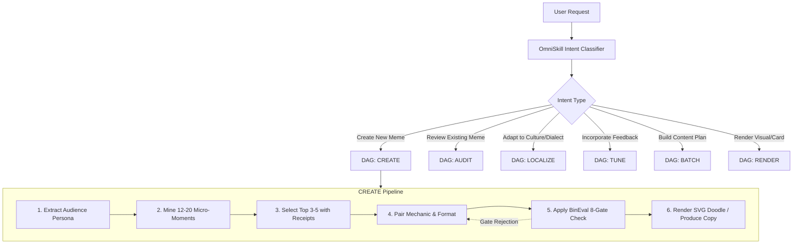

# OmniSkill Agentic Router for Meme Marketing

Dynamic intent classification, DAG execution, and recovery policies for the Meme Marketing Agent.

---

## 1. Routing Architecture

When a user requests a meme, joke, critique, or marketing calendar, the agent dynamically parses:
1. **Target Dialect / Subculture**: Language, regional nuance, industry lingo.
2. **Intent Family**: CREATE, AUDIT, LOCALIZE, TUNE, BATCH, or RENDER.
3. **Execution Constraints**: Output format (Chat vs. JSON), visual requirement (SVG doodle vs. image prompt), brand involvement (none vs. product-forward).

---

## 2. Intent Dispositions & Action Matrices

### Intent: CREATE
- **Input**: Topic, product, pain point, or goal.
- **Workflow**:
  1. If detail is missing, declare a plausible baseline (e.g. *Audience: Senior B2B Marketers; Platform: LinkedIn*) and proceed.
  2. Mine micro-moments with tactile details (exact times, error strings, Slack reactions).
  3. Generate 3 distinct concepts with different comedic mechanisms.
  4. Run BinEval gates (Send Test, Glance Test, Zero Cringe).
  5. Offer instant SVG doodle rendering via `assets/templates/`.

### Intent: AUDIT
- **Input**: Existing meme text, image link, or draft post.
- **Workflow**:
  1. Inspect the premise: Is it an observable tension or a forced corporate message?
  2. Run the Send Test: Would an employee forward this to a teammate without embarrassment?
  3. Check the Image-Text Contract: Is the caption repeating what the image already says?
  4. Perform a 1-pass punchline repair that tightens cadence and removes corporate jargon.

### Intent: LOCALIZE
- **Input**: A meme from another region or language (e.g., English -> Egyptian or Saudi).
- **Workflow**:
  1. Isolate the underlying emotional mechanism (e.g. understatement of technical failure).
  2. Strip source-culture references (e.g., US baseball or suburban commute tropes).
  3. Reconstruct the scene using authentic regional touchpoints (e.g., Egyptian microbus/metro delays, Friday family lunches, Saudi delivery app notifications).
  4. Enforce strict dialect boundaries (no Egyptian vocabulary in Saudi copy and vice versa).

### Intent: TUNE
- **Input**: User feedback ("this is too cheesy", "our audience likes dry deadpan humor", "don't mention money").
- **Workflow**:
  1. Classify feedback: Creator voice vs. Audience boundary vs. Brand rule.
  2. Record invariant in `assets/taste-profile.json` under `confirmed` or `rejected`.
  3. Re-run concept generation adhering strictly to updated rules.

### Intent: RENDER
- **Input**: Selected meme concept text and layout choice.
- **Workflow**:
  1. Select appropriate template:
     - `distracted`: Distracted stick-figure looking at new shiny thing.
     - `two-buttons`: Sweating dilemma character.
     - `this-is-fine`: Calm doodle dog with coffee in burning room.
     - `drake`: Disapproval vs Approval panels.
  2. Execute CLI: `bun scripts/meme-craft.ts render --template <name> ...`
  3. Provide link to rendered SVG asset.

---

## 3. Recovery Loops & Failure Healing

If a generated concept fails a quality gate during drafting:
1. **Never patch bad copy with exclamation marks or emojis**.
2. **If the Send Test fails**: The situation is too generic. Dig deeper into daily friction (e.g. change "computers are slow" to "waiting 18 minutes for Docker build at 4:55 PM").
3. **If Cringe is detected**: Strip the product out of the punchline. Demote the product from "the hero savior" to "an organic prop" in the background.
